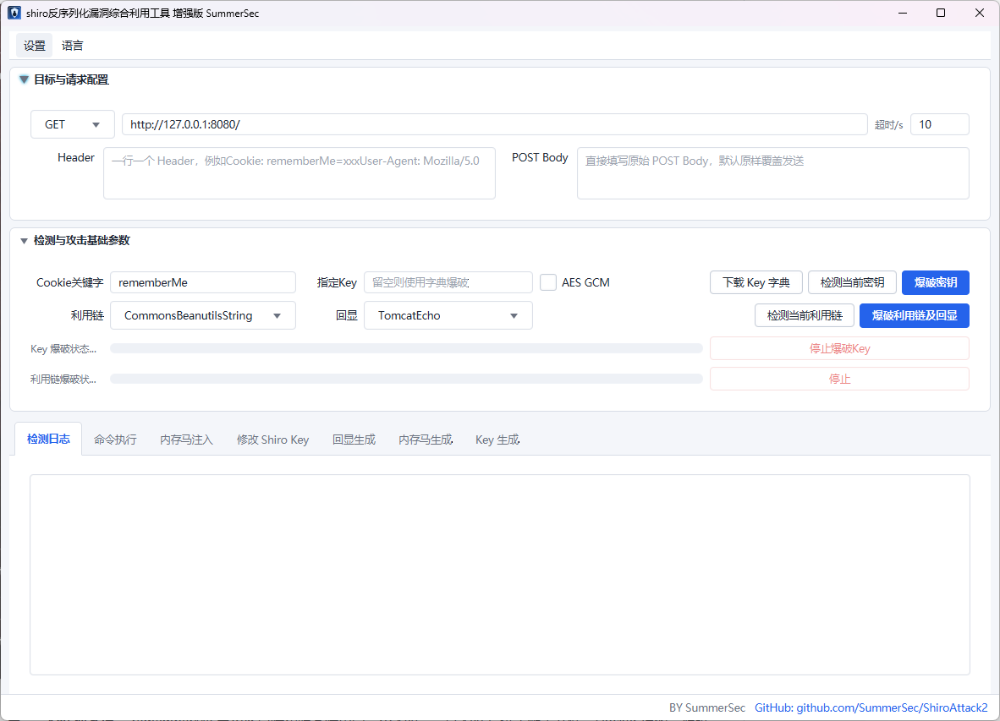

# 

<h1 align="center" >ShiroAttack2</h1>
<h3 align="center" >一款针对 Shiro-550 漏洞的快速漏洞利用工具</h3>
 <p align="center">
    <a href="https://github.com/SummerSec/ShiroAttack2"></a>
    <a href="https://github.com/SummerSec/ShiroAttack2"></a>
     <a href="https://github.com/SummerSec/ShiroAttack2"></a>
  <a href="https://github.com/SummerSec/ShiroAttack2"></a>
     <a href="https://github.com/SummerSec"></a>
     <a href="https://github.com/SummerSec"></a>
	<a href="https://twitter.com/SecSummers"></a>
	</p>

> 语言切换 / Language：**[中文](./README.md)** | [English](./README_EN.md)

完整使用说明：[docs/USAGE.md](./docs/USAGE.md)



---

## Shiro-550 为什么还能用

2016 年的洞，到现在还能用。不是漏洞本身多高级，而是三个很现实的原因叠在一起。

**第一，默认 Key。** Shiro 1.2.4 及之前版本在 `CookieRememberMeManager` 里硬写了一个 AES Key：`kPH+bIxk5D2deZiIxcaaaA==`。十几年来的教程和脚手架代码一直在拷贝这个值。

**第二，Key 换不掉。** rememberMe 要求客户端和服务端用同一个 Key。一旦 Key 写进了配置文件、Docker 镜像、源码仓库，要替换就得所有节点一起改。

**第三，利用成本足够低。** GUI 点几下就能拿 shell，CLI 可以直接嵌进脚本。

## 攻击流程

```
探测 ── 发 rememberMe=yes，看有没有 Set-Cookie: rememberMe=deleteMe
         Shiro 1.x 遇到非法 Cookie 一定会回 deleteMe

爆破 ── 用 SimplePrincipalCollection 序列化 + 候选 Key 逐个加密
         响应里没有 deleteMe 就是 Key 对了

Gadget ── 用确认的 Key 加密完整 Payload（Gadget 链 + TemplatesImpl 回显类）
命令执行 ── rememberMe Cookie 带着 Gadget Payload，命令写在 Authorization 头里
内存马 ── 同样的 Gadget 链注入 Filter/Servlet，不再依赖 rememberMe
Key 替换 ── 用内存马机制改掉 Shiro 的 AES Key，旧 Key 失效
```

## CLI 模式

5.0 之后增加了 CLI 模式。核心攻击逻辑 `AttackService`（1000+ 行）一行没改——通过继承 `TextArea` 拦截日志输出，利用 `ControllersFactory` 注册表注入假的 `MainController`，GUI 和 CLI 共用同一套攻击代码。CLI 不需要 JavaFX 窗口，启动时用一个 `JFXPanel` 初始化 JavaFX 线程即可。

```bash
# 启动 CLI
java -cp shiro_attack-<version>.jar com.summersec.attack.CLI.MainCLI <command> [options]
```

| 命令 | 用途 |
|------|------|
| `detect` | 探测目标是否为 Shiro 框架 |
| `crack` | 爆破或验证 Shiro AES Key |
| `exec` | 执行系统命令（自动探测 Gadget 链） |
| `memshell` | 注入内存马（哥斯拉/冰蝎/蚁剑等） |
| `changekey` | 替换目标 Shiro Key |
| `gui` | 启动 JavaFX 图形界面 |

`--json` 模式下输出分为两个通道：以 `{` 开头的是结构化日志，AI 或脚本可以按行 JSON.parse；不以 `{` 开头的是命令原始输出，`tail -1` 就能拿到结果。

AES 模式：`--cbc`（Shiro ≤1.2.4），`--gcm`（Shiro ≥1.2.5）。

Gadget 自动探测优先尝试 String/AttrCompare/ObjectToStringComparator 变体（无需 commons-collections），回退到依赖 `ComparableComparator` 的 CB 变体。

详细 CLI 用法见 [@skills/shiro-attack-cli/SKILL.md](./@skills/shiro-attack-cli/SKILL.md)（此文件是给 AI Agent 加载的 skill 描述，结构化为命令参数和排错规则）。

## 功能特点

- JavaFX GUI + CLI 双模式，同一套攻击逻辑
- 多版本 CommonsBeanutils gadget（1.8.3 / 1.9.2 / AttrCompare / ObjectToStringComparator）
- 自动 AES 模式切换：CBC 和 GCM 各走一遍，哪个命中锁哪个
- 内存马注入（Filter / Servlet / Interceptor / HandlerMethod / TomcatValve）
- 回显类型：TomcatEcho / SpringEcho / DFS-AllEcho / ReverseEcho / NoEcho
- 回显生成器（jEG）和内存马生成器（jMG）第三方集成，失败自动回退 Legacy
- Shiro Key 替换（6 条注入路径，自动验证新旧 Key）
- 自定义请求头、Cookie 合并、POST 型探测
- `--json` 结构化输出，适合脚本化和 AI 调用
- HTTP/HTTPS 代理（支持认证）
- Key 生成器

## 构建

```bash
# 安装本地 JAR（仅首次需要）
mvn install:install-file -Dfile=libs/jEG-Core-1.0.0.jar -DgroupId=jeg -DartifactId=jeg-core -Dversion=1.0.0 -Dpackaging=jar
mvn install:install-file -Dfile=libs/jmg-sdk-1.0.9.jar -DgroupId=jmg -DartifactId=jmg-sdk -Dversion=1.0.9 -Dpackaging=jar

# 打包 fat JAR（Java 8）
mvn clean package -DskipTests
# 产物: target/shiro_attack-5.1.1-all.jar
```

## 下载与运行

Release 提供两类产物：

- `shiro_attack-<version>-<jdk>.jar`：单文件可执行版本
- `shiro_attack-<version>-<jdk>-bundle.zip`：包含 `data/` 和 `lib/` 的完整压缩包

运行目录结构：

```
./
├── shiro_attack-{version}-{jdk}.jar
├── data/
│   └── shiro_keys.txt   # Key 字典，每行一个 Base64 Key
└── lib/                 # CommonsBeanutils 各版本 JAR
```

Release 由 GitHub Actions 在推送 tag（`v*` 或 `X.Y.Z`）时自动构建。可选版本说明放在 `docs/releases/<tag>.md`。

## 文档

| 文档 | 说明 |
|------|------|
| [docs/USAGE.md](./docs/USAGE.md) | 完整功能使用说明 |
| [docs/FAQ.md](./docs/FAQ.md) | 常见问题 |
| [docs/ShiroAttack2-v5-guide.md](./docs/ShiroAttack2-v5-guide.md) | 5.x 版本功能深度介绍 |
| [docs/memshell.md](./docs/memshell.md) | 内存马说明 |
| [docs/BypassWaf.md](./docs/BypassWaf.md) | WAF 绕过 |
| [docs/NoGadget.md](./docs/NoGadget.md) | 无 Gadget 场景 |
| [docs/THIRD_PARTY_GENERATORS.md](./docs/THIRD_PARTY_GENERATORS.md) | jEG/jMG 集成说明 |
| [AGENTS.md](./AGENTS.md) | OpenCode Agent 指令 |
| [@skills/shiro-attack-cli/SKILL.md](./@skills/shiro-attack-cli/SKILL.md) | AI Agent Skill 描述 |

## ⚠️ 免责声明

**免责声明：**

本文档仅用于**授权安全测试**和**学术研究**。**严禁**利用本文档内容进行任何非法活动。

**合规要求：**
- 所有渗透测试必须在获得**书面授权**后方可进行
- 使用者应遵守《中华人民共和国网络安全法》及相关法律法规
- 未经授权对未授权目标进行安全测试属于**违法行为**
- 使用者需自行承担所有法律风险和责任

**使用规范：**
- **严禁**在未授权的情况下对任何系统进行安全测试
- **严禁**将本工具用于任何形式的网络犯罪
- **严禁**在未经授权的情况下利用本工具获取的漏洞信息
- **严禁**将本工具分发给未授权使用者

**责任声明：**
- 本项目 (`ShiroAttack2`) 的开发者/维护者**不承担**任何因使用本工具而产生的法律责任
- 本工具仅供安全研究和授权测试用途
- 使用者在使用本工具前应确保已获得**明确的书面授权**
- 使用本工具即表示您同意遵守上述所有条款

**法律依据：**
- 《中华人民共和国刑法》第 285、286 条
- 《中华人民共和国网络安全法》
- 《中华人民共和国数据安全法》
- 《中华人民共和国个人信息保护法》

**报告漏洞：** 如发现安全漏洞，请通过负责任的方式披露，勿直接公开漏洞细节。

---


